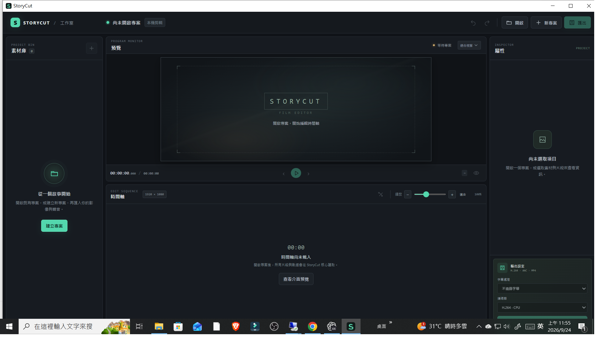
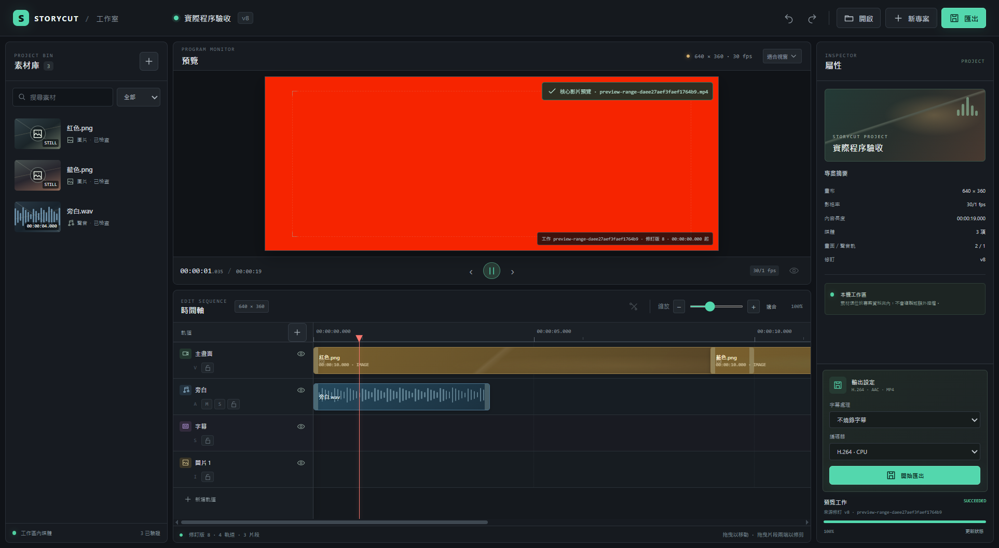
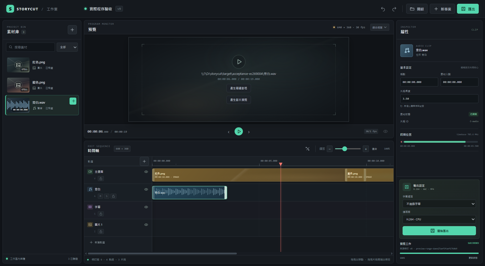
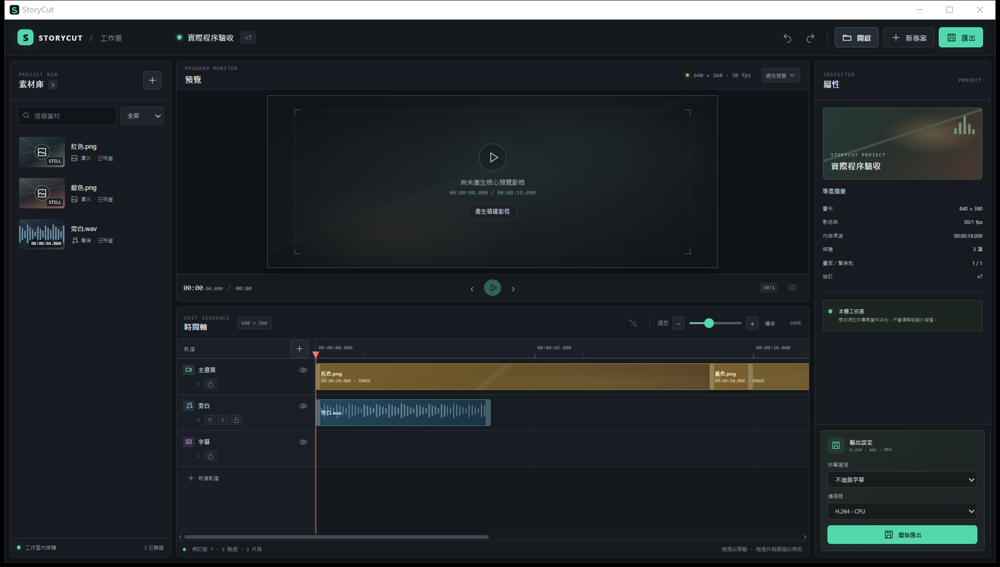
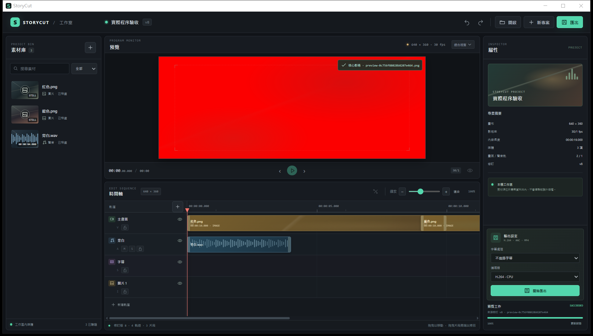
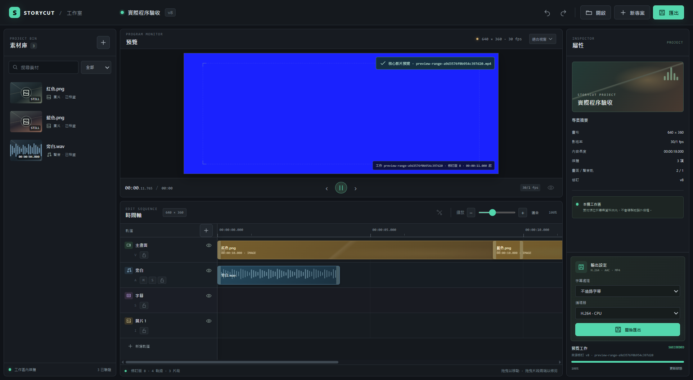

# Windows Native Desktop Acceptance

This record separates the native Tauri application from the browser-only interface preview. All timeline edits, preview generation, and export jobs below were submitted to the shared Rust `storycut-command` dispatcher.

## Environment

- Windows 10 Pro, build 19045; Windows 11 and clean-machine installation have not been certified.
- Node.js 24.20.0, npm 11.17.0, Rust 1.94.1, FFmpeg 8.1.1, WebView2 153.0.4234.48.
- Tauri 2 release executable: `desktop/src-tauri/target/release/storycut-desktop.exe`.
- Acceptance workspace: `D:\storycut\target\acceptance-ec269004`.
- Project: `實際程序驗收`, ID `p-9860e4d27d238b17c1910a9fcf545936151bdd79853b061df4bb887c90aec5c0`.

## Final release build and package

Built from the same final desktop source with:

```powershell
cd D:\storycut\desktop
npm run build
cargo test --offline --locked
npm run tauri build -- --no-bundle
npm run tauri build -- --bundles msi,nsis --no-sign
```

Results on 2026-09-24:

- Release executable: `desktop/src-tauri/target/release/storycut-desktop.exe` — 11,525,120 bytes.
- MSI: `desktop/src-tauri/target/release/bundle/msi/StoryCut_0.1.0_x64_en-US.msi` — 3,768,320 bytes.
- NSIS: `desktop/src-tauri/target/release/bundle/nsis/StoryCut_0.1.0_x64-setup.exe` — 2,508,923 bytes.
- MSI and NSIS bundle creation passed. Signing was skipped; neither installer has been installed or tested.
- `npm run build` passed. `cargo test --offline --locked` passed (the preview bridge integrity test: 1/1).

The portable ZIP was extracted into a fresh directory on this Windows host. Its GUI executable SHA-256 matched the final release executable, and the extracted CLI returned `ok=true` with 29 implemented tools from `capabilities`. After closing the earlier release test process, the extracted `StoryCut.exe` opened a normal native window (PID 25868, title `StoryCut`). The OS-level window screenshot includes its border and taskbar:



This confirms local portable startup. The MSI/NSIS installers and a clean Windows environment remain untested. An initial portable launch while the release test instance was still running created only a small process window; the normal window appeared after both test instances were closed and the portable executable was relaunched.

## Native release round-trip and playback

The release executable was launched directly. The existing project was opened through the native Common File Dialog, setting its filename field to the test workspace’s `demo.storycut.json`. The Tauri window then displayed the project at revision 8 with 3 media assets, 4 tracks, and 3 clips. The project remained inside `target/acceptance-ec269004`.

From that native UI, the “產生影片預覽” control dispatched `storycut_preview_range` to the shared command core. CLI `storycut_job_get` independently read back:

- Job `preview-range-daee27aef3faef1764b9`, state `succeeded`, source revision 8.
- MP4 artifact `.storycut/previews/preview-range-daee27aef3faef1764b9.mp4`, 112,533 bytes, SHA-256 `6770aaa32f99fb0a8a57d844fa17173f6c30575a157b75ac21ab5158a31bcaa5`.
- `ffprobe` identified H.264 video at 640×360 and 30 fps, plus AAC audio. Both streams start at 0 seconds and run for 6 seconds.
- In the native WebView, the video reached `readyState=4`, `duration=6`, `error=null`; clicking Play produced `paused=false` and advancing `currentTime` (about 1.04 seconds in the saved frame).

An initial release attempt returned `MEDIA_ELEMENT_ERROR: Media load rejected by URL safety check` for the validated MP4 data URL. The Tauri CSP was narrowedly amended with `media-src 'self' data: blob:`. Rebuilt release playback then passed; the MP4 bytes and SHA-256 matched the core job record.

The saved images below are captured from the Tauri release WebView surface over loopback DevTools. They are native application screens, not the browser-only demo; they do not include the Windows desktop or window border.



## Native trim to shared-core readback

In the release UI, the `旁白.wav` right trim handle was dragged left by 0.5 seconds in the acceptance project. The UI advanced from revision 8 to revision 9. The CLI independently read back revision 9 and clip `C-audio` with `start_tick=0` and `duration_ticks=2469600000`, equal to 3.5 seconds at the project timebase. Before the edit it was 4 seconds.

```powershell
$workspace = 'D:\storycut\target\acceptance-ec269004'
$cli = 'D:\storycut\target\debug\storycut.exe'
& $cli --json --workspace $workspace call storycut_timeline_get `
  --args-file "$workspace\desktop-gui-trim-readback.json"
```



## Native export record

A previous Tauri native development-window acceptance submitted GUI export through the shared core. CLI `storycut_job_get` returned render job `render-6da12b1c1f90ced07f5f` as `succeeded`, source revision 8, with a 137,609-byte MP4 artifact at `D:\storycut\target\acceptance-ec269004\實際程序驗收.mp4` (SHA-256 `52f49d73075156dbe6a4a6c733d3ea08260019b0094e76e66eb63c6db02891aa`). `ffprobe` verified 19 seconds, 640×360 H.264 at 30 fps (570 frames), and AAC audio starting at 0 seconds and lasting 19 seconds (892 audio frames). This GUI export was verified in the native development window, not re-run in the final release executable.

## Earlier native-core screenshots

These earlier native Tauri development-window screenshots document opening the same acceptance project, a shared-core track edit/readback, and a rendered PNG frame. They are retained as additional evidence; the final release playback and trim evidence is above.








`查看介面預覽` opens the browser-only presentation mode. It does not write to the core and is not counted as product acceptance.

## Portable black-window capture follow-up (2026-09-24)

The black capture from the portable relaunch investigation is not valid evidence that the WebView page rendered black. Inspection of the live portable process PID 25008 showed `Responding=True`, but the window was minimized: `IsIconic=True`, `GetWindowRect=(-32000,-32000,199x34)`, and client size `0x0`. A `CopyFromScreen` capture was fully black; `PrintWindow` returned true but captured only the minimized titlebar. Those files are retained under `D:\storycut\target\diagnostics\portable-minimize-restore-20260924\` and explicitly named as invalid minimized-window captures.

Calling `ShowWindow(SW_RESTORE)` on that same PID, without Ctrl+R or restarting it, restored the window to `0,0 1942x1102` and the complete editor appeared. The restored capture is [native-portable-restored-without-reload.png](acceptance/native-portable-restored-without-reload.png). This establishes that the black diagnostic image was caused by capturing a minimized window; it does not reproduce a blank WebView page. No product source change was made. The earlier `native-portable-*` screenshots are not used as proof of cold-start rendering because the capture did not record window state.

The original reported-black screenshot was moved out of `desktop/acceptance` and retained at `D:\storycut\target\diagnostics\portable-minimize-restore-20260924\reported-black-native-portable-relaunch-invalid-minimized-capture.png`. The separate post-reload image remains in `desktop/acceptance`, but neither original screenshot is used as proof because its window state was not captured.
